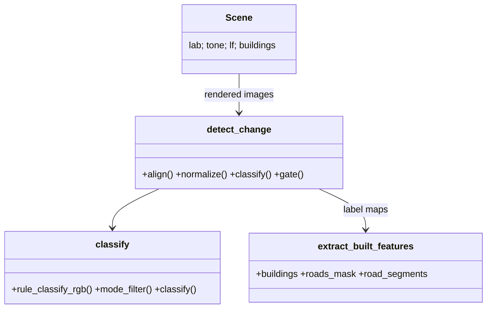

# Component / data diagram

```mermaid
classDiagram
  class Scene { lab; tone; lf; buildings }
  class detect_change { +align() +normalize() +classify() +gate() }
  class classify { +rule_classify_rgb() +mode_filter() +classify() }
  class extract_built_features { +buildings +roads_mask +road_segments }
  Scene --> detect_change : rendered images
  detect_change --> classify
  detect_change --> extract_built_features : label maps
```
