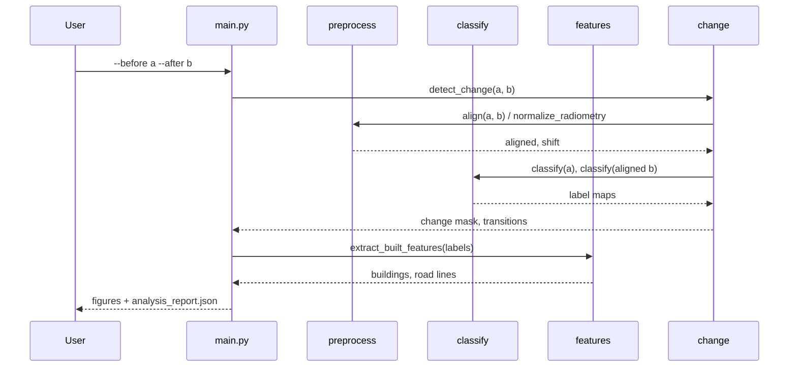

# Sequence

```mermaid
sequenceDiagram
  participant U as User
  participant M as main.py
  participant P as preprocess
  participant C as classify
  participant F as features
  participant G as change
  U->>M: --before a --after b
  M->>G: detect_change(a, b)
  G->>P: align(a, b) / normalize_radiometry
  P-->>G: aligned, shift
  G->>C: classify(a), classify(aligned b)
  C-->>G: label maps
  G-->>M: change mask, transitions
  M->>F: extract_built_features(labels)
  F-->>M: buildings, road lines
  M-->>U: figures + analysis_report.json
```
