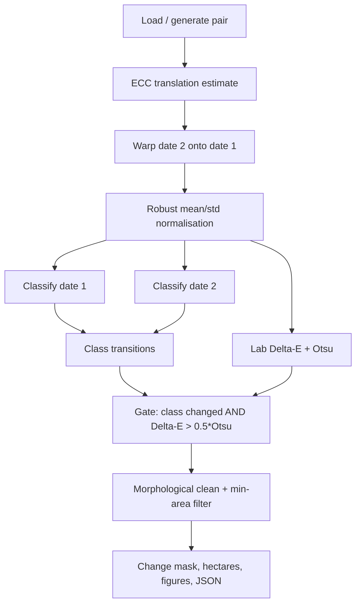

# Workflow

```mermaid
flowchart TD
  S[Load / generate pair] --> R[ECC translation estimate]
  R --> W[Warp date 2 onto date 1]
  W --> N[Robust mean/std normalisation]
  N --> C1[Classify date 1]
  N --> C2[Classify date 2]
  C1 --> T[Class transitions]
  C2 --> T
  N --> D[Lab Delta-E + Otsu]
  T --> G[Gate: class changed AND Delta-E > 0.5*Otsu]
  D --> G
  G --> M[Morphological clean + min-area filter]
  M --> O[Change mask, hectares, figures, JSON]
```
